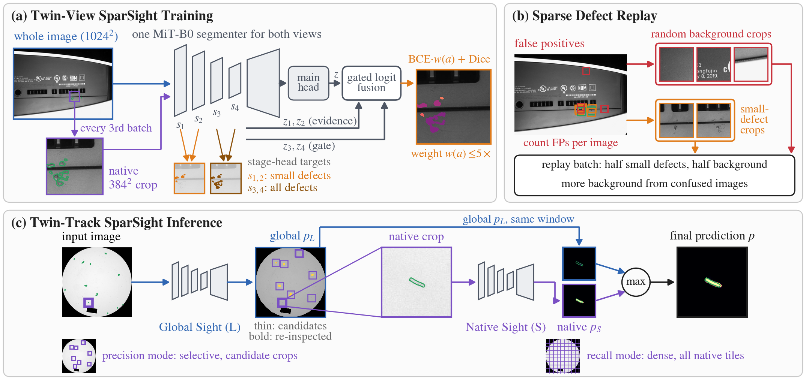
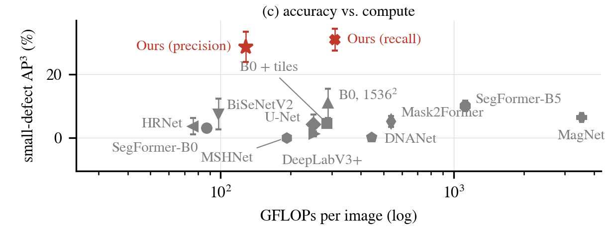

# Seeing the Few Pixels That Matter: Lightweight Two-Track Segmentation for Sparse Defect Inspection

Code for the paper submitted to IEEE ICCE 2027 (release `v1.0-icce2027` = the submitted version).

Defects on consumer-electronics parts often cover a few pixels of a multi-megapixel image. A lightweight
segmenter that works on the downscaled image loses them; the same segmenter applied to native-resolution tiles
finds them, together with many false alarms that the wider context would have ruled out. This repository trains
**one 3.8 M-parameter SegFormer (MiT-B0)** to use both views and runs it as a two-track inspector.



**Training** (`configs/<dataset>/ours_stage1.yaml`, then `ours.yaml`)
1. *Two views.* Every second batch of downscaled whole images is followed by a batch of 384x384 crops taken at
   the original resolution (centred on a defect with probability 0.5).
2. *Size-aware supervision* (whole-image batches). Defect pixels of small components get up to 5x more weight in
   the BCE term of the main head. Stage heads on the four encoder stages are trained at the same time (the shallow
   two on small defects only) and are **discarded at inference**: the deployed network is the plain MiT-B0
   segmenter.
3. *Confusion replay.* The trained model segments its own training images at native resolution; its false
   positives (print, vents, edges) and small defects are replayed in a 20-epoch refinement.

**Inference** (`tools/evaluate_zoom.py`)
- *Precision mode*: the whole image is segmented at low resolution; the 32 strongest candidate peaks are
  re-segmented on native 384x384 crops by the same network, and native evidence outside the low-resolution
  support is down-weighted.
- *Recall mode*: the whole image is tiled at native resolution.

## Results

Test splits, mean over 3 seeds, thresholds selected on validation. AP<sub>s</sub>: defects below the 33rd
percentile of training component area; AP<sup>3</sup>: 3-pixel boundary-tolerant AP. Full tables (all
competitors, standard deviations, ablation) are produced by `tools/paper_tables.py`.

**VISION** (sparse defects; 81% of the defect regions cover < 0.1% of the image)

| Method | Params | GFLOPs | Latency | AP | AP<sub>s</sub> | AP<sub>s</sub><sup>3</sup> | AUPRO<sub>s</sub> |
|---|---|---|---|---|---|---|---|
| SegFormer-B0 | 3.7M | 87 | 58 ms | 86.0 | 1.5 | 3.1 | 83.0 |
| SegFormer-B0, 1536<sup>2</sup> input | 3.7M | 290 | 120 ms | 87.3 | 3.7 | 10.7 | 84.8 |
| U-Net (R34) | 24.4M | 250 | 58 ms | 81.1 | 1.2 | 4.2 | 54.5 |
| SegFormer-B5 | 84.6M | 1120 | 97 ms | **89.1** | 3.9 | 9.8 | 86.0 |
| Mask2Former (Swin-T) | 47.4M | 540 | 110 ms | 88.3 | 2.7 | 5.1 | 81.7 |
| **Ours, precision mode** | 3.8M | 125 | 116 ms | 88.2 | **5.6** | **18.9** | 90.2 |
| **Ours, recall mode** | 3.8M | 308 | 302 ms | 87.4 | 5.0 | 18.4 | **91.5** |

<p align="center"></p>

**MVTec AD** (Defect Spectrum protocol)

| Method | Params | AP | AP<sub>s</sub> | AUPRO | mIoU |
|---|---|---|---|---|---|
| SegFormer-B0 | 3.7M | 90.8 | 10.8 | 96.3 | 87.1 |
| SegFormer-B5 | 84.6M | 92.5 | 12.9 | 96.6 | **88.0** |
| HRNet-W18-small | 3.9M | 90.7 | 18.7 | 95.3 | 86.6 |
| SuperSimpleNet | 33.7M | 88.6 | 12.7 | 96.3 | 83.7 |
| **Ours, precision mode** | 3.8M | **92.9** | **19.7** | **97.7** | 87.8 |

Latency: one A100, batch 1, end to end from the decoded image to the full-resolution map (resizing included), mean
over 200 test images; GFLOPs count a multiply-add as 2. The precision mode costs 1.4x the FLOPs of SegFormer-B0
but its latency is close to that of the larger models, because reading and handling the full-resolution image
dominates it. On VISION the 22x larger SegFormer-B5 remains more accurate on large defects (overall AP, mIoU).

## Setup

```bash
bash scripts/setup_env.sh          # conda env "sds": Python 3.10, PyTorch 2.3.1 (CUDA 12.1), requirements.txt
bash scripts/download_weights.sh   # ImageNet / ADE20K weights into pretrained/
bash scripts/get_third_party.sh    # competitors' reference code into third_party/ (not needed for ours)
```

**Data** (not redistributed; download from the original sources and accept their licenses):

| Dataset | Put it at | Then run |
|---|---|---|
| [VISION](https://huggingface.co/datasets/VISION-Workshop/VISION-Datasets) (14 categories, COCO polygons) | `data/VISION/<Category>/{train,val}/` | `python tools/prepare_vision.py` (rasterises the masks into `data/VISION_masks/`) |
| [MVTec AD](https://www.mvtec.com/company/research/datasets/mvtec-ad) | `data/MVTec_AD/<category>/` | nothing |

The splits used in the paper are in `data/splits/` (file names only). VISION: test = the official labelled
`val` split; the official `train` split is divided into Core / Mining / Validation (70/15/15). The PCB_2 category
is excluded by a rule fixed before any experiment (`data/splits/vision/sanity_report.json`). MVTec AD follows
the Defect Spectrum protocol: 5 defect images per defect type for training, 20% of the rest for validation.
`python tools/prepare_vision.py` and `python tools/prepare_mvtec_ds.py` regenerate them.

## Our method

```bash
# 1) two-view, size-aware training
python tools/train.py --config configs/vision/ours_stage1.yaml
# 2) mine the model's own native-resolution false positives, refine with confusion replay
python tools/mine_native_fp.py --exp outputs/vision_ours_stage1 --out data/replay/vision/vision_ours_stage1.json
python tools/train.py --config configs/vision/ours.yaml
# 3) evaluate both operating points (validation selects the threshold; --test adds the test split)
python tools/evaluate_zoom.py --exp outputs/vision_ours --mode precision --test            # strict AP
python tools/evaluate_zoom.py --exp outputs/vision_ours --mode precision --test --tol 3    # 3-px tolerant AP
python tools/evaluate_zoom.py --exp outputs/vision_ours --mode recall --test
```

Other seeds: `--opts seed=1` (outputs go to `<experiment_id>_s1`). For the refinement of another seed, pass its
checkpoint and replay file: `--opts seed=1 refine.init_checkpoint=outputs/vision_ours_stage1_s1/best.pt
refine.replay_file=data/replay/vision/vision_ours_stage1_s1.json`. MVTec AD: replace `vision` by `mvtec_ad`
in the config paths (experiment ids start with `mvtec_`).

## Reproducing the paper

```bash
bash scripts/reproduce.sh vision ours           # and: mvtec_ad ours
bash scripts/reproduce.sh vision baselines      # Table II competitors (MVTec AD: Table I)
bash scripts/reproduce.sh vision ablation       # Table III (validation split)
python tools/measure_modes.py                   # end-to-end latency of every method on one GPU
python tools/paper_tables.py --split test       # tables -> outputs/paper/tables/
python tools/figures/fig3_tradeoff.py --split test
python tools/analysis/track_disagreement.py --exp outputs/vision_ours --split test
python tools/analysis/bootstrap_small.py        # paired bootstrap of the small-defect AP differences
```

| Config | Paper |
|---|---|
| `configs/<ds>/ours_stage1.yaml`, `ours.yaml` | ours (before / after confusion replay) |
| `configs/<ds>/baselines/*.yaml` | SegFormer-B0/B5, B0 at 1536^2, U-Net, DeepLabV3+, HRNet-W18-small, BiSeNetV2, Mask2Former, DNANet, MSHNet |
| `tools/external/magnet_seg.py`, `supersimplenet_seg.py` | MagNet (VISION), SuperSimpleNet (MVTec AD), with the authors' code (SuperSimpleNet runs in the environment of its repository: PyTorch Lightning, anomalib) |
| `configs/<ds>/ablation/*.yaml` | ablation (two views, stage heads, size-aware supervision, inference-time fusion, refinement controls, update-matched B0) |
| `configs/vision/diagnostics/*.yaml` | small-target models with their authors' recipes and on native crops |
| `tools/external/irstd_sanity.py` | DNANet / MSHNet reproduced on their own benchmarks (NUAA-SIRST, IRSTD-1k) |

All competitors use the same splits, input size, augmentation and evaluator. Models trained with their own loss
(BiSeNetV2, Mask2Former, DNANet, MSHNet) treat the letterbox padding as background, as in their reference code; the
others ignore it. Training budget: two-view training takes 1.24x the optimizer updates of a whole-image baseline and,
with the 20-epoch refinement, 1.6x in total; `ablation/b0_update_matched.yaml` and the equal-step refinement controls
(`ablation/refine_*.yaml`) separate these extra updates from the method. Changes to the reference
implementations are limited to what the data require and are listed in the paper (SuperSimpleNet samples defect
images only; MagNet uses per-image scales up to the native resolution; Mask2Former is re-headed for two classes;
the small-target models and MagNet are reported with the BCE+Dice recipe because their own losses collapse).

## Evaluation protocol (`sds/metrics.py`)

- Pixel AP from score histograms in **logit space** (262,144 bins), equal to the AP on the raw scores up to
  ties; uniform probability bins merge the saturated scores of confident models. Probabilities are kept in
  float64 during evaluation (a float32 sigmoid is exactly 1.0 above logit 16.6); thresholds and AUPRO use an
  8,192-bin logit grid.
- Boundary-tolerant AP: a defect pixel is scored by the maximum prediction within 3 px, and background within
  3 px of a defect is not a negative.
- AUPRO up to FPR 0.3, mIoU (background, defect), target-level P<sub>d</sub>/F<sub>a</sub> at threshold 0.5
  (centroid distance < 3 px, as in the infrared small-target literature).
- Thresholds are selected on validation (best F1) and applied unchanged to test; size groups use the 33rd/66th
  percentiles of the training split for every method.

Every run records its config, a run id, split hashes and the git commit; refinement refuses a replay file that
was not mined from its init checkpoint, and an existing output directory is never overwritten.

## Layout

```
sds/            data pipeline, models, losses, metrics
tools/          train / evaluate / two-track inference / mining / efficiency / tables / figures
configs/        one self-contained YAML per experiment (vision/, mvtec_ad/)
data/splits/    split files used in the paper
scripts/        environment, weights, third-party code, full reproduction
tests/          unit tests (python -m pytest tests -q); SDS_E2E=1 runs a synthetic end-to-end check
```

## License

The code in this repository is released under the MIT License. Datasets, pretrained weights and the
third-party code fetched by the scripts keep their own licenses (VISION and MVTec AD: non-commercial research
use; MiT/SegFormer weights: NVIDIA Source Code License, non-commercial; MagNet: AGPL-3.0).

## Citation

```bibtex
@inproceedings{kim2027sparse,
  title     = {Seeing the Few Pixels That Matter: Lightweight Two-Track Segmentation for Sparse Defect Inspection},
  author    = {Kim, Junhan},
  booktitle = {Proc. IEEE Int. Conf. Consumer Electronics (ICCE)},
  year      = {2027},
  note      = {under review}
}
```
